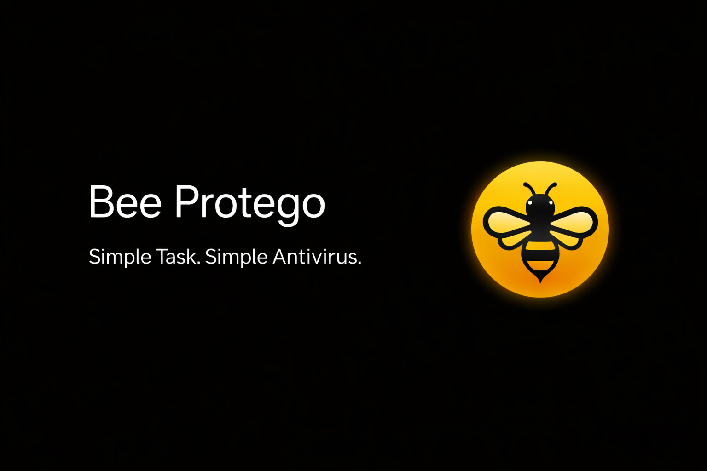

<h1 align="center">Bee Protego</h1>

Malware Detection and Security Analysis Toolkit

<h2>Overview</h2>

Bee Protego is a lightweight cybersecurity toolkit designed for malware scanning, threat detection, and security research. 
The system uses rule-based detection powered by YARA signatures to identify suspicious binaries, malicious documents, 
and exploit patterns. Bee Protego integrates scanning modules, rule databases, and reporting mechanisms into a single analysis pipeline.

<h2>System Requirements</h2>

<table border="1" cellpadding="6">
<tr>
<th>Component</th>
<th>Requirement</th>
</tr>

<tr>
<td>Operating System</td>
<td>Windows / Linux / macOS</td>
</tr>

<tr>
<td>Python Version</td>
<td>Python 3.9 or higher</td>
</tr>

<tr>
<td>RAM</td>
<td>Minimum 4 GB recommended</td>
</tr>

<tr>
<td>Disk Space</td>
<td>1 GB recommended for rule databases</td>
</tr>

</table>

<h2>Required Python Modules</h2>

<table border="1" cellpadding="6">

<tr>
<th>Module</th>
<th>Purpose</th>
</tr>

<tr>
<td>requests</td>
<td>HTTP communication and API interaction</td>
</tr>

<tr>
<td>reportlab</td>
<td>PDF report generation</td>
</tr>

<tr>
<td>yara-python</td>
<td>YARA rule execution for malware detection</td>
</tr>

</table>

Install dependencies:

<pre>
pip install -r requirements.txt
</pre>

<h2>External Dependencies</h2>

<table border="1" cellpadding="6">

<tr>
<th>Tool</th>
<th>Description</th>
</tr>

<tr>
<td>YARA</td>
<td>Pattern matching engine used for malware detection</td>
</tr>

</table>

YARA executable must be located in the project directory.

<h2>Installation</h2>

Clone the repository from GitHub.

<pre>
git clone https://github.com/smilymouth/BeeProtego.git
cd BeeProtego
</pre>

Install required packages.

<pre>
pip install -r requirements.txt
</pre>

Run the application.

<pre>
python BeeProtego.py
</pre>

<h2>Project Structure</h2>

<pre>
BeeProtego
│
├── BeeProtego.py
├── README.md
├── LICENSE
├── .gitignore
│
├── yara64.exe
├── favicon.ico
│
├── full_sha256.txt
│
├── cve_rules
│   └── CVE detection rules
│
├── maldocs
│   └── malicious document detection rules
│
├── malware
│   └── malware detection rules
│
├── cve_rules_index.yar
├── maldocs_index.yar
└── malware_index.yar
</pre>

<h2>Detection Workflow</h2>

<pre>
User Input
   │
   ▼
File Enumeration
   │
   ▼
YARA Rule Matching
   │
   ▼
Threat Detection
   │
   ▼
Result Processing
   │
   ▼
Report Generation
</pre>

<h2>Generated Reports</h2>

<table border="1" cellpadding="6">

<tr>
<th>Report Type</th>
<th>Description</th>
</tr>

<tr>
<td>PDF Security Report</td>
<td>Summary of detected threats and scan results</td>
</tr>

<tr>
<td>Detection Log</td>
<td>List of files that matched YARA rules</td>
</tr>

</table>

<h2>Local AI Assistant (Optional)</h2>

Bee Protego can integrate with a local AI model to explain detected threats.

Recommended local runtime:

Ollama

Installation:

<pre>
https://ollama.ai
</pre>

Install model:

<pre>
ollama pull llama3
</pre>

Run local model:

<pre>
ollama run llama3
</pre>

The AI assistant can analyze detected threats and provide explanations for malware indicators.

<h2>Security Research Applications</h2>

<ul>
<li>Malware analysis environments</li>
<li>Exploit document detection</li>
<li>YARA rule testing</li>
<li>Cybersecurity research</li>
<li>Educational security labs</li>
</ul>

<h2>License</h2>

MIT License

<h2>Author</h2>

smilymouth  
Cybersecurity Researcher

