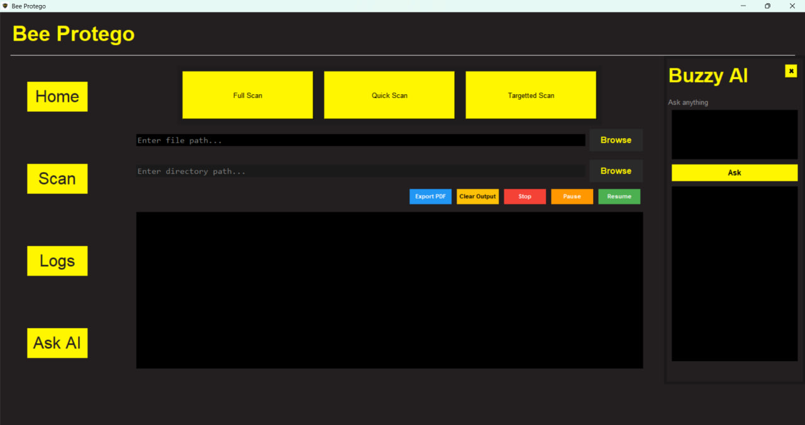

<h1 align="center">Bee Protego</h1>

Malware Detection and Security Analysis Toolkit

<strong>Overview</strong>  
Bee Protego is a lightweight cybersecurity toolkit designed for malware detection, file analysis, and security research.
It uses YARA-based rule matching to identify malicious patterns and integrates scanning, detection, and reporting into a unified workflow.

 

<strong>Key Features</strong>
<ul>
<li>YARA-based malware detection</li>
<li>Multi-file scanning</li>
<li>Automated PDF reporting</li>
<li>Modular rule engine</li>
<li>Optional AI-based threat explanation</li>
</ul>

<h2>Preview</h2>

<h2>Quick Start</h2>

<pre>
git clone https://github.com/smilymouth/BeeProtego.git
cd BeeProtego
pip install -r requirements.txt
python BeeProtego.py
</pre>

<h2>Detection Flow</h2>

Input

Scan

Detect

Process

Report

<h2>Performance Overview</h2>

<table border="1" cellpadding="8" cellspacing="0" style="border-collapse:collapse; width:100%">
<tr style="background:#2c3e50; color:white;">
<th>Metric</th>
<th>Value</th>
</tr>
<tr><td>Scan Speed</td><td>Fast</td></tr>
<tr style="background:#f2f2f2;"><td>Accuracy</td><td>Rule-based precision</td></tr>
<tr><td>Resource Usage</td><td>Low to moderate</td></tr>
</table>

<h2>AI Integration</h2>

Local AI support using Ollama for threat explanation.

<pre>
ollama pull llama3
ollama run llama3
</pre>

<h2>License</h2>

MIT License

<h2>Author</h2>

smilymouth 
Cybersecurity Researcher

